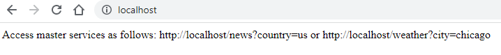
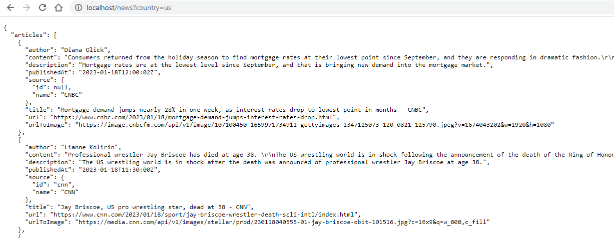
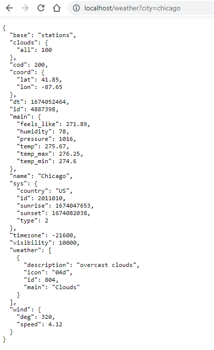

# Build and deploy
We will build, deploy and scale using the docker-compose command
```
docker-compose up --build --scale master=2
```
This will tell docker-compose to :

* Read the docker-compose.yml file
* Build all the container images 
* Run all the containers in detached mode
* Scale the `master` image to 2 instances

## Start all containers

```
PS C:\Users\aniru\workspace\github\python-nginx-microservice> docker compose up
[+] Running 5/5
 - Network python-nginx-microservice_default      Created                                                                                                                                          1.1s 
 - Container python-nginx-microservice-news-1     Created                                                                                                                                          0.8s 
 - Container python-nginx-microservice-master-1   Created                                                                                                                                          0.8s 
 - Container python-nginx-microservice-weather-1  Created                                                                                                                                          0.8s 
 - Container nginx                                Created                                                                                                                                          0.2s 
Attaching to nginx, python-nginx-microservice-master-1, python-nginx-microservice-news-1, python-nginx-microservice-weather-1
```
We can now test if the containers are running. 
```
PS C:\Users\aniru\workspace\github\python-nginx-microservice> docker compose ps
NAME                                  COMMAND                  SERVICE             STATUS              PORTS
nginx                                 "/docker-entrypoint.…"   nginx               running             0.0.0.0:80->80/tcp
python-nginx-microservice-master-1    "python master_assis…"   master              running             3001/tcp
python-nginx-microservice-master-2    "python master_assis…"   master              running             3001/tcp
python-nginx-microservice-news-1      "python news.py"         news                running             0.0.0.0:3003->3003/tcp
python-nginx-microservice-weather-1   "python weather.py"      weather             running             0.0.0.0:3002->3002/tcp
```
As you can see, this indicates :

* nginx service is running as `nginx` on port:80
* master service is running as `python-nginx-microservice-master-1` and `python-nginx-microservice-master-1` on internal port:3001
* news service is running as `python-nginx-microservice-news-1` on port:3002 
* weather service is running as `python-nginx-microservice-weather-1` on port:3003 

## Test the application
Now we will test the application by invoking 3 URLs:

* **Index page** : In this case the following code is executed in the master service


* **News page** : We will now query all news for the day in US 
```
http://localhost/news?country=us
```
Let's check the logs by using command `docker logs <container-name> -f`
```
PS C:\Users\aniru\workspace\github\python-nginx-microservice> docker logs python-nginx-microservice-news-1 -f
 * Serving Flask app "news" (lazy loading)
 * Environment: production
   WARNING: This is a development server. Do not use it in a production deployment.
   Use a production WSGI server instead.
 * Debug mode: on
 * Running on http://0.0.0.0:3003/ (Press CTRL+C to quit)
 * Restarting with stat
 * Debugger is active!
 * Debugger PIN: 329-461-268
172.28.0.3 - - [18/Jan/2023 20:22:42] "GET /news?country=de HTTP/1.1" 200 -
172.28.0.3 - - [18/Jan/2023 20:55:28] "GET /news?country=us HTTP/1.1" 200 -
```


* **Weather page** : 
```
http://localhost/weather?city=chicago
```
Let's check the logs by using command `docker logs <container-name> -f`
```
PS C:\Users\aniru\workspace\github\python-nginx-microservice> docker logs python-nginx-microservice-weather-1 -f
 * Serving Flask app "weather" (lazy loading)
 * Environment: production
   WARNING: This is a development server. Do not use it in a production deployment.
   Use a production WSGI server instead.
 * Debug mode: on
 * Running on http://0.0.0.0:3002/ (Press CTRL+C to quit)
 * Restarting with stat
 * Debugger is active!
 * Debugger PIN: 858-141-160
172.28.0.2 - - [18/Jan/2023 20:22:45] "GET /weather?city=amsterdam HTTP/1.1" 200 -
172.28.0.2 - - [18/Jan/2023 20:59:38] "GET /weather?city=amsterdam HTTP/1.1" 200 -
```


## Test the load-balancer
Open two separate terminals and run:
```
docker logs python-nginx-microservice-master-1 -f
docker logs python-nginx-microservice-master-2 -f
```
Now invoke these URLs in random while observing the logs:

* [news-test](http://localhost/news?country=us) 
* [weather-test](http://localhost/weather?city=chicago) 
