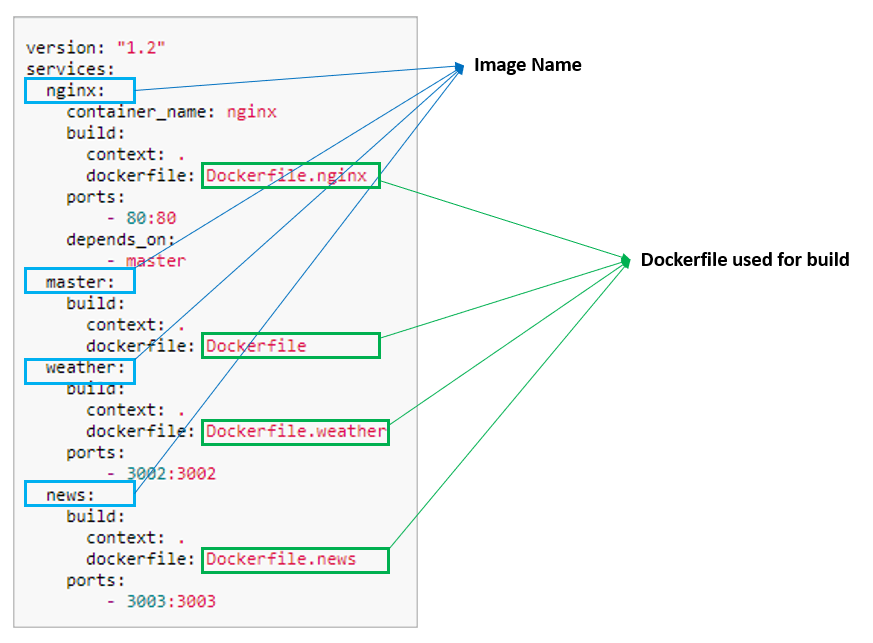

# Create Docker Compose
We will define the `docker-compose.yml` file in this section. This is used by docker-compose to build and start all the services. 



## Create Docker Compose file
Create file `docker-compose.yml` and copy following contents:
```
version: "1.2"
services:
  nginx:
    container_name: nginx
    build:
      context: .
      dockerfile: Dockerfile.nginx
    ports:
        - 80:80
    depends_on:
        - master
  master:
    build:
      context: .
      dockerfile: Dockerfile
  weather:
    build:
      context: .
      dockerfile: Dockerfile.weather
    ports:
        - 3002:3002
  news:
    build:
      context: .
      dockerfile: Dockerfile.news
    ports:
        - 3003:3003
```

This tells docker-compose to:

* Create 4 container images : 
    * nginx : This uses `Dockerfile.nginx` and maps internal container port:80 to external port:80
    * master : This uses `Dockerfile`. Note that we are not providing a mapping of internal port:3001 as we expect to scale this app to many instances
    * weather : This uses `Dockerfile.weather` and maps internal container port:3002 to external port:3002
    * news : This uses `Dockerfile.news` and maps internal container port:3003 to external port:3003