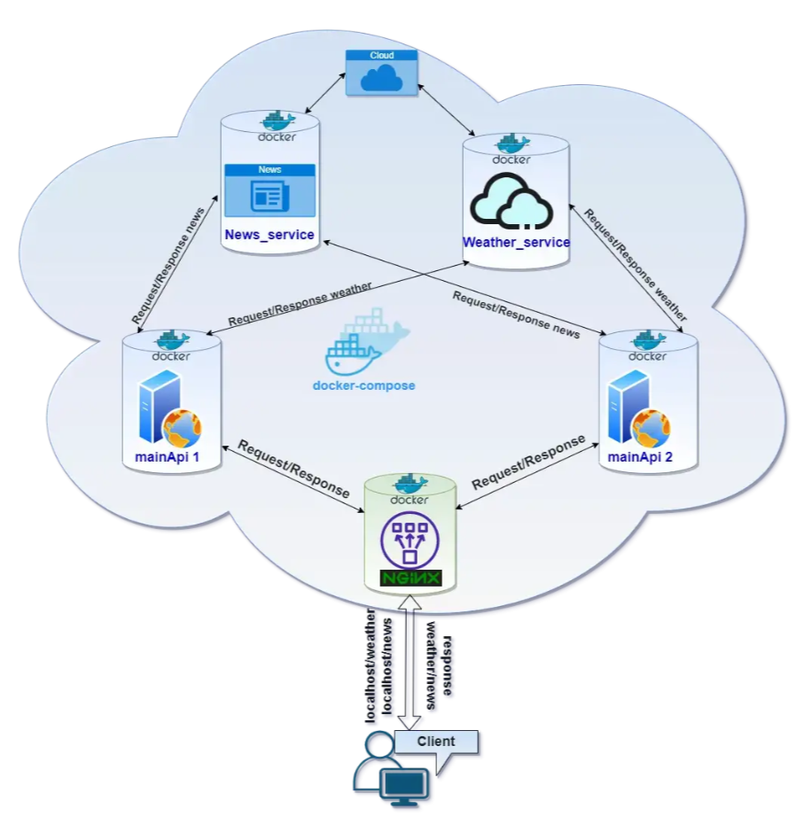

# Introduction
This is a simple python based application that demonstrates how to deploy a microservice application that is fronted by a nginx load-balancer. All application components are packaged as containers and orchestrated using docker-compose. 


## Application components
This application has the following components:

* nginx service - This is used to front all traffic and load-balance it across the master-services
* master service - Represents the scaled-out main application used to front and redirect traffic to appropriate downstream services - news & weather
* news service - Represents the news service that delivers the news by country. News service uses publicly available service [NewsAPI](https://newsapi.org/)
* weather service - Represents the weather service that delivers the weather by city. Weather service uses a publicly available service [OpenWeather](https://openweathermap.org/api)

## Application Structure
```
  |── docs                      # Contains edited nginx configuration file that will be copied to the image
  |    ├── img                  # Contains all images referenced in mkdocs
  |    ├── *.md                 # Other mkdocs .md files
  ├── mkdocs.yml                # YAML for for mkdocs
  ├── .gitattributes
  |
  ├── Dockerfile                # Dockerfile for the main application
  ├── Dockerfile.nginx          # Dockerfile for the nginx load-balancer
  ├── Dockerfile.news           # Dockerfile for the news service
  ├── Dockerfile.weather        # Dockerfile for the weather service
  ├── requirements.txt          # Specifies packages that need to be installed in the container
  |
  ├── docker-compose.yaml       # Defines docker-compose.yaml file for web-app & nginx-reverse-proxy
  ├── nginx.conf                # Contains edited nginx configuration file that will be copied to the image
  |
  ├── master_assistant.py       # Simple primary app built using Python's Flask API
  ├── weather.py                # Simple weather app built using Python's Flask API
  ├── news.py                   # Simple news app using Python's Flask API
  |
  ├── README.md                 # Standard README.md file
```
## Pre-requisites
* This application only requires python and docker installed on your computer
* Create project folder `python-nginx-microservice`
* Navigate to project folder 
```
    PS C:\Users\aniru\workspace\github> cd .\python-nginx-microservice\
    PS C:\Users\aniru\workspace\github\python-nginx-microservice>
```
* ***Important*** : Ensure all files are in UTF-8 format. UTF-16 causes issues with Docker. 
* Copy and create file `requirements.txt`. This will be used to tell docker to install required software. 
```
aniso8601==8.1.0
blinker==1.4
certifi==2020.12.5
chardet==4.0.0
click==7.1.2
Flask==1.1.2
Flask-Jsonpify==1.5.0
flask-requests==0.0.14
Flask-RESTful==0.3.8
Flask-SQLAlchemy==2.4.4
idna==2.10
itsdangerous==1.1.0
Jinja2==2.11.2
MarkupSafe==1.1.1
pampy==0.3.0
pytz==2020.4
requests==2.25.1
six==1.15.0
SQLAlchemy==1.3.20
urllib3==1.26.3
Werkzeug==1.0.1
```


## Credits
I would like to thank the author (@manos_kakarakis) of this orginal post whose code and methodology I have used as is. 
[Python Flask scalable microservices using docker-compose and Nginx load balancer](https://medium.com/@manos_kakarakis/python-flask-scalable-microservices-using-docker-compose-and-nginx-load-balancer-e20d421b1ad6)

